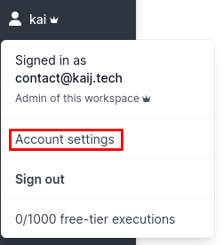
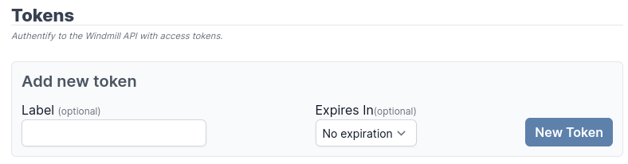

# Windmill Sync Example

This repo demonstrates how to syncronize definitions between GitHub and Windmill
automatically. This means that changes on either platform will be propagated to
the other.

See also
[backup example](https://github.com/windmill-labs/windmill-backup-example) and
[push example](https://github.com/windmill-labs/windmill-push-example).

## Setup

Write access to the workspace is required. This is done using an access token.
To generate a new token log into your windmill instance
(https://app.windmill.dev/ for cloud hosted instances) and navigate to the
account settings, which contains a "Tokens" section, use the relevant button
there to generate a new token. Note that you will only be able to copy this
token once!

 

Add an environment "windmill" to the repository via the settings. You may name
this anything, but will need to adjust the workflow accordingly. Then add a
secret "WMILL_TOKEN" to this environment.

Edit the workflow in
[.github/workflows/push.yaml](./.github/workflows/push.yaml), usually you'll
only need to fill out the `env` variables, then activate GitHub actions by
navigating to the "Actions" tab in GitHub. You may want to run the action once
manually to see that everything works, in the future the action will be
automatically ran on a schedule.

### Security

In some cases it may be useful to take extra care, especially when users have
access to the automated repo that do not have write access to the repository. To
do so, create a separate account that can only access this specific
workspacewith write access and use a token issued using this account. This can
be done using the UI or the
[wmill cli](https://github.com/windmill-labs/windmill/blob/main/cli/README.md).

It may additionally be useful to restrict the GitHub environment.
[The GitHub help article](https://docs.github.com/en/actions/deployment/targeting-different-environments/using-environments-for-deployment)
goes into detail of all the options.

## Tracking Changes

The
[wmill cli](https://github.com/windmill-labs/windmill/blob/main/cli/README.md)
is used to manage what files are tracked, a folder with state `.wmill` is
maintained, similar to the well known `.git` folder. To start tracking a file,
use `wmill sync add <file>`. On the next push/pull the file will be considered
and both the local and remote versions updated. Note that only `.json` files
should be tracked, for scripts the relevant content file (`.py`, `.ts`, `.go`)
will be tracked automatically.
